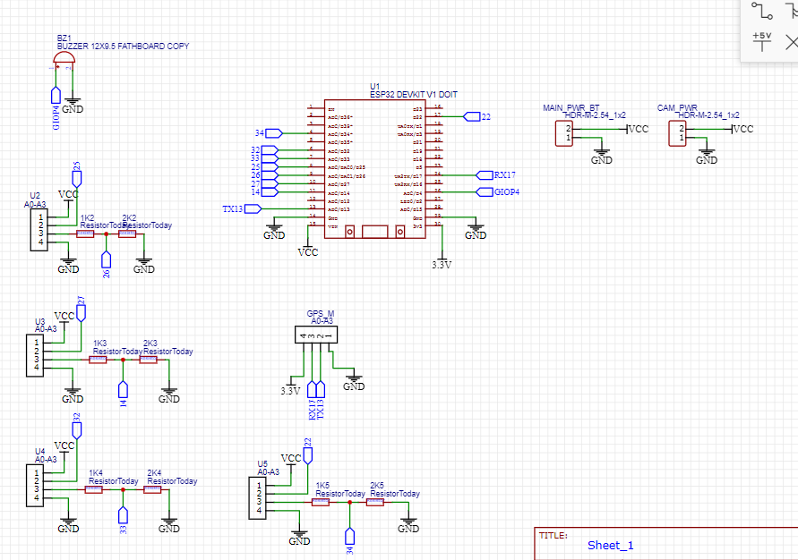

# Alat Bantu Tunanetra Berbasis ESP32

## Deskripsi

Alat Bantu Tunanetra Berbasis ESP32 merupakan perangkat portabel yang dirancang untuk membantu penyandang tunanetra dalam mendeteksi halangan di sekitar serta memungkinkan keluarga melakukan pemantauan lokasi dan kondisi pengguna secara jarak jauh melalui Telegram.

Sistem menggunakan sensor ultrasonik untuk mendeteksi objek di sekitar pengguna, buzzer sebagai peringatan suara, modul GPS untuk memperoleh lokasi, dan ESP32-CAM untuk mengambil gambar ketika diminta melalui Telegram.

---

## Tujuan Proyek

- Membantu pengguna tunanetra mendeteksi halangan di sekitar.
- Memberikan peringatan dini menggunakan buzzer.
- Memungkinkan keluarga mengetahui lokasi pengguna secara real-time.
- Memungkinkan keluarga memperoleh foto kondisi sekitar pengguna melalui Telegram.
- Mengoptimalkan penggunaan daya agar perangkat dapat digunakan secara portable.

---

## Fitur Utama

✅ Deteksi halangan menggunakan 4 sensor HC-SR04

✅ Peringatan suara menggunakan buzzer

✅ Pelacakan lokasi menggunakan GPS NEO-6M

✅ Pengambilan foto menggunakan ESP32-CAM

✅ Integrasi Telegram Bot

✅ Pengiriman lokasi dan foto secara jarak jauh

✅ Sistem hemat daya dengan aktivasi GPS dan kamera saat diperlukan

✅ Menggunakan baterai Li-ion 18650 yang dapat diisi ulang

---

## Komponen Hardware

| Komponen | Jumlah |
|-----------|---------|
| ESP32 WROOM 32 | 1 |
| ESP32-CAM | 1 |
| ESP32-CAM-MB | 1 |
| Sensor Ultrasonik HC-SR04 | 4 |
| GPS NEO-6M-0-001 | 1 |
| Buzzer | 1 |
| Modul TP4056 | 1 |
| Baterai Li-ion 18650 | 1 |

---

## Arsitektur Sistem

### ESP32 WROOM 32

Berfungsi sebagai pengendali utama sistem:

- Membaca data sensor ultrasonik
- Mengontrol buzzer
- Mengelola komunikasi Telegram
- Membaca data GPS
- Mengatur manajemen daya
- Berkomunikasi dengan ESP32-CAM

### ESP32-CAM

Berfungsi sebagai modul kamera:

- Mengambil gambar
- Mengirim gambar saat ada permintaan dari Telegram

---

## Cara Kerja Sistem

### Mode Normal

1. Sensor ultrasonik aktif memantau lingkungan sekitar.
2. Jika objek terdeteksi pada jarak ≤ 30 cm:
   - Buzzer akan berbunyi.
3. GPS dan kamera dalam kondisi tidak aktif untuk menghemat daya.

### Mode Permintaan Telegram

Ketika keluarga mengirim perintah melalui Telegram:

1. Sistem mengaktifkan GPS.
2. ESP32-CAM mengambil gambar.
3. Lokasi pengguna dibaca dari GPS.
4. Foto dan lokasi dikirim ke Telegram.

---

## Diagram Blok Sistem

```text
Baterai 18650
       │
    TP4056
       │
   ESP32 WROOM
   ├── HC-SR04 (4x)
   ├── Buzzer
   ├── GPS NEO-6M
   ├── WiFi
   └── UART
          │
          ▼
      ESP32-CAM
          │
       Kamera
```

---

## Konfigurasi Pin

### ESP32 WROOM 32

| Fungsi | GPIO |
|---------|--------|
| Trigger Sensor 1 | GPIO25 |
| Echo Sensor 1 | GPIO26 |
| Trigger Sensor 2 | GPIO27 |
| Echo Sensor 2 | GPIO14 |
| Trigger Sensor 3 | GPIO12 |
| Echo Sensor 3 | GPIO13 |
| Trigger Sensor 4 | GPIO32 |
| Echo Sensor 4 | GPIO33 |
| Buzzer | GPIO4 |

### Komunikasi ESP32 ↔ ESP32-CAM

Menggunakan jaringan yang sama 

## Library Arduino IDE

Library yang digunakan:

- WiFi.h
- TinyGPSPlus
- UniversalTelegramBot
- ArduinoJson
- NewPing
- esp_camera.h

---

## Perintah Telegram

| Perintah | Fungsi |
|-----------|---------|
| /foto | Mengambil dan mengirim foto |
| /lokasi | Mengirim lokasi pengguna |
| /status | Menampilkan status perangkat |

---
## PCB Design



---

## Pengembangan Selanjutnya

- Motor getar sebagai pengganti buzzer
- Tombol SOS darurat
- Deteksi jatuh (fall detection)
- Navigasi suara
- Integrasi GSM untuk area tanpa WiFi
- Monitoring level baterai melalui Telegram

---

## Status Proyek

🚧 Dalam Tahap Pengembangan dan Pengujian

---

## Penulis

Dikembangkan sebagai proyek Embedded System berbasis ESP32 untuk membantu meningkatkan mobilitas dan keamanan penyandang tunanetra.
